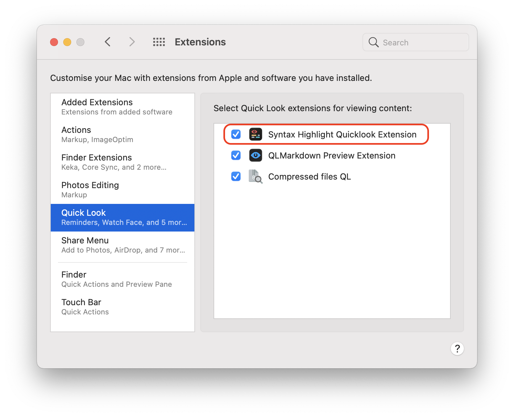
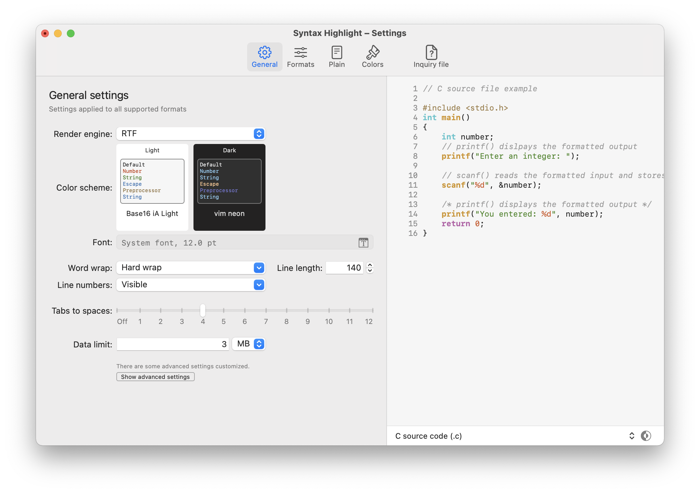
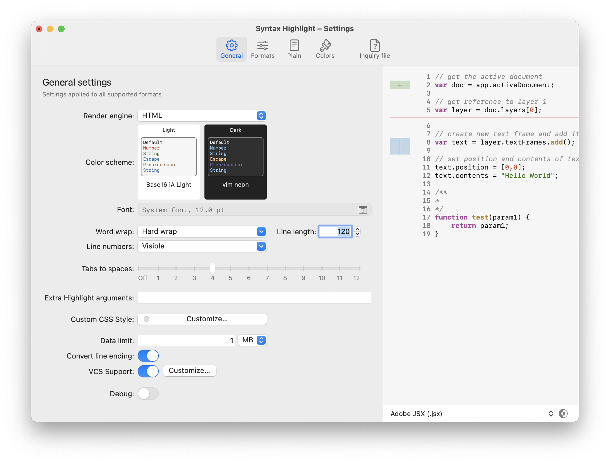
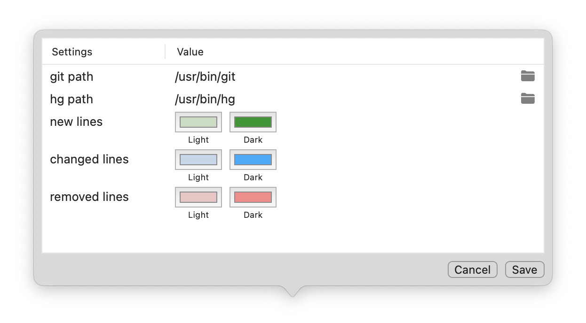
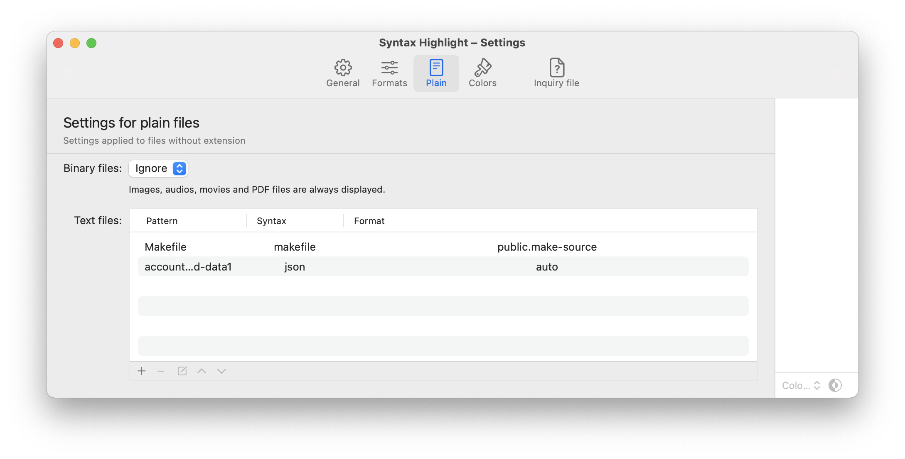
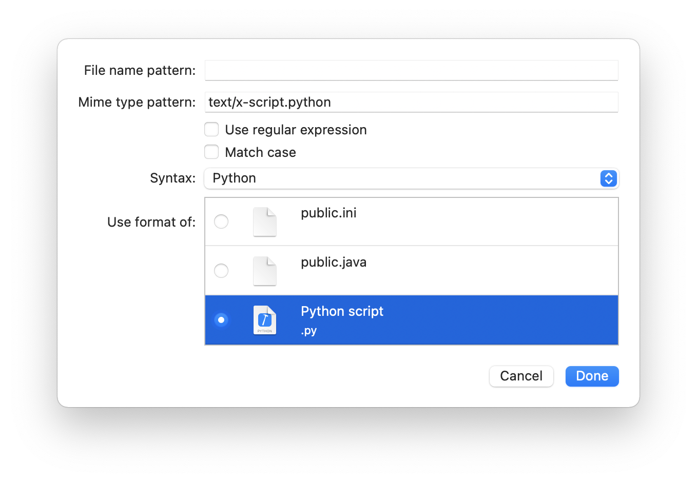
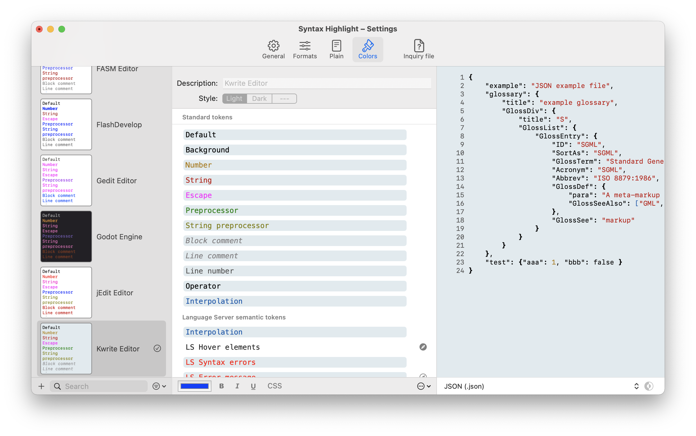
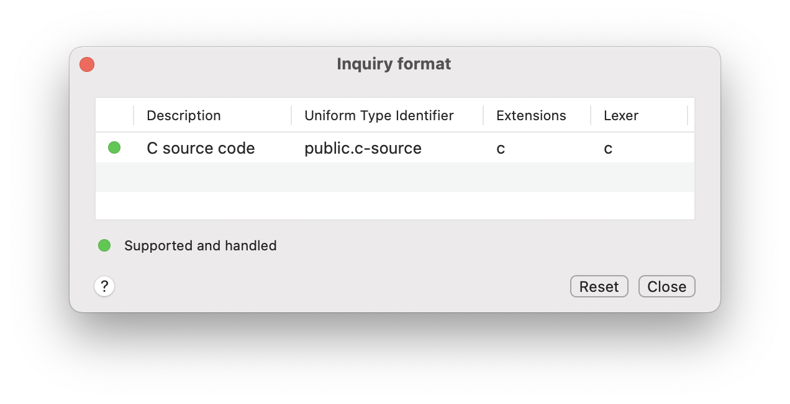
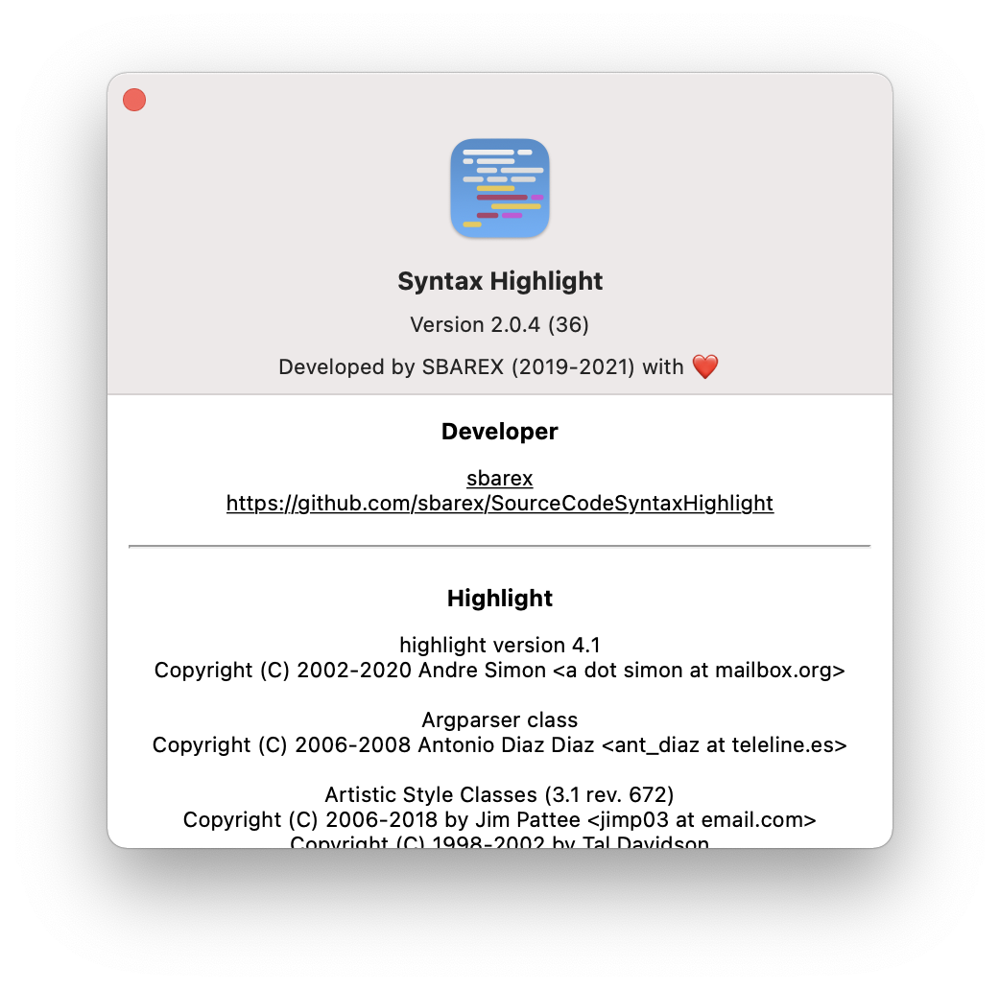

<p align="center">
  
</p>

#  Syntax Highlight

The application offers a Quick Look Extension for macOS 10.15 Catalina and later for previewing source files.
Inside it uses [Highlight](http://www.andre-simon.de/doku/highlight/en/highlight.php) to render source code with syntax highlighting.

> **`Syntax Highlight` is distributed in the hope that it will be useful but WITHOUT ANY WARRANTY.**

  - [Installation](#installation)
    - [Download precompiled release](#download-precompiled-release)
    - [Install with Homebrew Cask](#install-with-homebrew-cask)
    - [Note for the precompiled release](#note-for-the-precompiled-release)
    - [Build from source](#build-from-source)
  - [Enable the Quick Look extension](#enable-the-quick-look-extension)
  - [File format management](#file-format-management)
    - [Supported formats](#supported-formats)
  - [Application settings](#application-settings)
    - [Rendering settings](#rendering-settings)
      - [External Language Server support](#external-language-server-support)
      - [Version control support](#version-control-support)
    - [Plain files](#plain-files)
    - [Colors](#colors)
    - [Inquiry file](#inquiry-file)
  - [Command line interface](#command-line-interface)
  - [FAQ](#faq)
  - [Known bugs](#known-bugs)
  - [Note for developers](#note-for-developers)
    - [Info about decoding dynamic UTI identifiers](#info-about-decoding-dynamic-uti-identifiers)
  - [Credits](#credits)

  
## Installation

You can install the application in various ways. When the main application is launched it automatically checks for updates. 

After installation, _the application must be launched at least once to allow the system to detect the Quick Look extension_. [See below](#enable-the-quick-look-extension) for instructions on how to enable the Quick Look extension. 

### Download precompiled release
Head over to the [releases](https://github.com/sbarex/SourceCodeSyntaxHighlight/releases) page to view the latest version. Move the `Syntax Highlight.app` into the `Applications` folder.

### Install with Homebrew Cask
Syntax Highlight can also be installed via [Homebrew Cask](https://github.com/Homebrew/homebrew-cask). If you have not installed Homebrew, follow the simple instructions [here](https://brew.sh/). After that, run `brew install --cask syntax-highlight` to install the current version of Syntax Highlight.

### Note for the precompiled release
The [precompiled app](https://github.com/sbarex/SourceCodeSyntaxHighlight/releases) is not notarized or signed, so the first time you run the app the system may show a warning about the impossibility to check for malicious software.

To fix, you can launch the app with right click (or ctrl click) on the app icon and choose the open action.

You can also execute this command from the terminal:

```
$ xattr -r -d com.apple.quarantine "FULL PATH OF THE Syntax Highlight.app (you can drag the file to get the pull path)"
```

Alternatively, after trying to launch the app for the first time, you can open the `System Preferences > Security & Privacy > General (tab)` and click the `Open Anyway` button.

This will resolve the error of an unsigned application when launching the app.

### Build from source

The release application is compiled as universal binary (Intel and Apple Silicon processor).

After cloning remember to fetch submodules:

```
$ git submodule init
$ git submodule update
```

## Enable the Quick Look extension
_To use the Quick Look preview you must launch the Application at least once._ In this way the Quick Look Extension will be discovered by the system and will be available in the `System preferences > Extensions > Quick Look`.



When opening the app _for the first time_, you may see a pop-up warning about unable to check malicious software.

To fix follow these steps: 

- Switch to Finder and navigate to the application. 
- Right click (or ctrl click) `Syntax Highlight.app` and choose the `Open` item from the contextual menu. 
- A modal popup appears stating:
  > "Syntax Highlight.app" can’t be opened because Apple cannot check it for malicious software.
- Click `Open` to confirm.

This warning is because the app is neither codesigned nor notarized.

For more info see the [note for the precompiled release](#note-for-the-precompiled-release).

## File format management

The Quick Look Extension uses the [Uniform Type Identifier (UTI)](https://developer.apple.com/library/archive/documentation/FileManagement/Conceptual/understanding_utis/understand_utis_intro/understand_utis_intro.html) to handle the supported formats (and not simply the file name extension).
Inside the definition on an UTI there are the list of extensions and mime type associated with it.

Some file types are directly associated to an UTI by the system. Other formats are registered by the owner application. In this way some extensions can be associated to multiple UTIs based on the applications currently installed. For this reason, this application supports many UTIs even if they are apparently redundant.

_**MacOS 10.15 Catalina does not** allow to manage some file formats including (but not limited to):_  `.xml`, `.plist`, `.html`, `.ts`, `.dart`, common images (`.jpg`, `.gif`, `.png`), …

On _**macOS 11 Big Sur**, the system allows you to manage these previously unauthorized extensions:_ `.plist`.

On _**macOS 12 Monterey**, the system allows you to manage these previously unauthorized extensions:_ `.xml`.

### Supported formats

Most programming languages are supported. 
The application can also handle some [plain files](#plain-files) without extension.

- (G)AWK files (`.awk`)
- HTML Abstraction Markup Language (`.haml`)
- Adobe Acrobat Sequence files (`.sequ`) _as `XML`_
- Adobe Flash ActionScript source files (`.as`)
- Adobe JSX script files (`.jsx`)
- Apple workflow (`.wflow`) _as `plist (XML)`_
- AppleScript (`.scpt`, `.applescript`, `.ascr`) _automatically decompiled with `osadecompile`_
- Assembler source files (`.s79`)
- Azkaban flow files (`.flow`) as _`YAML`_
- ATL files (`.atl`)
- Bash Script files (`.bash`)
- C Shell script files (`.csh`)
- C Source files (`.c`, `.h`)
- C# Source files (`.cs`)
- C++ Source files (`.cpp`, `.cp`, `.c++`, `.cc`, `.cxx`, `.hpp`, `.hh`, `.hxx`, `.ipp` )
- Clojure Script (`.cli`, `.cljs`, `.cljc`, `.edn`)
- CMake files (`.cmake`)
- CocoaPod files (`.podspec`) _as `Ruby`_
- Coffee source files (`.coffee`)
- Coldfusion files (`.cfc`, `.cfm`, `.cfml`)
- Configuration files (`.conf`)
- CSON source files (`.cson`)
- CSS files (`.css`)
- Dart source files (`.dart`) **`.dart` is reserved by macOS and cannot be handled.**
- Diff files (`.diff`, `.patch`)
- DOS Bat files (`.bat`, `.cmd`)
- ECore files (`.ecore`)
- Eiffel project files (`.ecf`) _as `XML`_
- Eiffel source files (`.e`, `.ex`, `.exs`)
- Erlang source files (`.erl`, `.hri`)
- F# source files (`.fsx`, `.fs`)
- Fish source files (`.fish`)
- Fortran source files (`.f`, `.for`, `.f90`)
- GCC Linked files (`.ld`, `.map`, `.d`)
- GoLang source files (`.go`)
- Google Earth KML Document files (`.kml`) _as `XML`_
- Gradle source files (`.gradle`)
- Groovy source files (`.groovy`)
- Haskell source files (`.hs`, `.lhs`)
- IDL source files (`.pro`)
- INF files (`.inf`)
- INI configuration files (`.ini`, `.cfg`)
- Inno source files (`.iss`)
- INO source files (`.ino`)
- Interface Builder Storyboard (`.storybard`) _as `XML`_
- Interface Builder XIB (`.xib`) _as `XML`_
- Java Compiled Class (`.class`) _require `javap` to decompile_
- Java Properties files (`.properties`) _as `INI`_
- Java Server Page files (`.jsp`)
- Java source code (`.java`, `.jav`)
- Java Web Start (`.jnlp`)
- JavaFX ML (`.fxml`)
- Javascript files (`.js`, `.jscript`, `.javascript`, `.mjs`)
- Jetbrains Project file (`.iml`)
- JSON files (`.json`) (_beautify with `python3`_)
- Julia source files  (`.jl`)
- Kermeta source files (`.kmt`)
- Korn Shell script files (`.ksh`)
- Kotlin source files (`.kt`, `.kts`)
- Less stylesheet (`.less`)
- Lisp source files (`.lisp`, `.lsp`, `.asd`, `.el`)
- Logos source files (`.xm`)
- Lua source files (`.lua`)
- Makefile files (`.mk`, `.mak`)
- MF source files (`.mf`)
- Microsoft Active Server Page files (`.asp`)
- Microsoft PowerShell files (`.psm1`, `.psd1`, `.ps1`)
- Nim source files (`.nim`)
- Objective-C source files (`.m`)
- Objective-C++ source files (`.mm`)
- OCaml source files (`.ml`, `.mll`, `.mly`)
- OPML (Outline Processor Markup Language) files (`.opml`) _as `XML`_
- Paradox files (`.sc`)
- Pascal source files (`.pas`)
- Patch files (`.patch`, `.diff`)
- PDE source files (`.pde`, `.ino`)
- Perl script files (`.pl`, `.pm`)
- PHP source files (`.php`, `.php3`, `.php4`, `.ph3`, `.ph4`, `.phtml`)
- Properties files (`.properties`) _as `INI`_
- Property List files (`.plist`) _dynamically decompiled with `plutil`_ **On macOS 10.15 Catalina `.plist` is reserved by the system and cannot be handled.**
- Python source files (`.py`)
- Racket (`.rkt`) _as `Lisp`_
- RDF files (`.rdf`)
- Rez files (`.r`)
- Ruby on Rails files (`.rhtml`, `.erb`, `.rjs`)
- Ruby Gems file (`.gemfile`)
- Ruby script (`.rb`, `.rbw`)
- Rust source files (`.rs`)
- SASS/SCSS files (`.scss`)
- Scala source files (`.sc`, `.sbt`, `.scala`)
- Scheme source files (`.scm`)
- Shell script files (`.bashrc`, `.zshrc`, `.sh`, )
- SQL files (`.sql`)
- Standard ML source files (`.ml`)
- Svelte (`.svelte`) _as `HTML`_
- Swift source files (`.swift`)
- Symfony Twig files (`.twig`)
- TCL source files (`.tcl`)
- Tenex C Shell script files (`.tcsh`)
- TeX and LaTeX files (`.tex`, `.sty`, `.cls`, `.latex`, `.ltx`, `.texi`, `.ctx`, `.sty`)
- Text files (`.txt`, `.text`)
- Toml files (`.toml`)
- Typescript files (`.ts`, `.tsx`) **`.ts` is reserved by macOS and cannot be handled.**
- Verilog HDL files (`.v`, `.vl`)
- VHDL source files (`.vhd`, `.vhdl`)
- VIM script files (`.vim`)
- Visual Basic source files (`.vb`, `.bas`, `.basic`, `.vbs`)
- Vue source files (`.vue`)
- XAML source files (`.xaml`) _as XML_
- Xcode entitlement files (`.entitlements`) (dynamically decompiled with `plutil`) _as XML_
- Xcode localizable strings files (`.strings`, `.stringsdict`) (dynamically decompiled with `plutil`) _as XML_ 
- XHTML files (`.xhtml`)
- XML files (`.xml`) **Before macOS 12 Monterey `.xml` is reserved by the system and cannot be handled.**
- XSD Schema files (`.xsd`, `.xquery`)
- XUL files (`.xul`)
- YAML files (`.yaml`)
- Z Shell script files (`.zsh`)

## Application settings

With the standalone application you can customize the rendering settings.



You can show _advanced settings_ using the relative command on the view menu.




### Rendering settings

You can set the settings for all supported formats on the _General_ tab.

|Settings|Description|Advanced|
|:---------|:-------------| :----: |
|Render engine|Engine used to render the highlighted code. _Before macOS 12 Monterey_ **the recommended engine is `RTF`.** Choose the `HTML` engine if you want to use a custom CSS to override the color scheme (or you have choose a theme with some extra CSS inside it). Advanced users must choose the `HTML` engine to handle the hover functionality of a Language Server. ||
|Color scheme|Chose the color scheme for light and dark appearance.||
|Font|You can chose a preferred font or use the standard monospaced font.||
|Word wrap|Allow to handle word wrap for long lines. _Hard wrap_ break the line after a fixed length (_can cause some highlight glitch_). _Soft wraps_ allow to break the line at the preview windows width. When word wraps is disabled, you can only enable it for minified files that have only one line. One line file detection is done on the source file and not on the preprocessor output. **Starting from macOS 12 Monterey the soft wrap is always enabled when using the `RTF` engine.** ||
|Line numbers|Allow to show the line numbers.||
|Tabs to spaces|Allow to translate tabs to spaces. Set to zero to use tabs. ||
|Extra highlight arguments|Additional standard argument passed to `highlight`. **Arguments that contains a white space must be protected inside quotes.** See `man highlight` to a list of valid arguments and plugins. Eg: `--doc-title='title with space'` |Yes|
|Custom CSS Style| If the render engine is set to _HTML_ allow to define a custom CSS style to override/extend the color scheme. More info about `highlight` HTML output on [this page](https://gitlab.com/saalen/highlight/wikis/CSS-Themes).|Yes|
|Interactive preview| _DEPRECATED and available only before macOS 12 Monterey._ If the render engine is set to _HTML_ enable the javascript interpreter inside the preview window. Set only if you use some `highlight` plugins that output javascript code. This option disable the possibility to move the Quick Look preview with click and drag inside the window and opening the file with a double click. |Yes|
|Data limit| Maximum amount of data to format, data beyond the limit is omitted. Specify 0 to not limit. This option is ignored when using a Language Server. ||
|Convert line ending| Allow to convert Windows (`CRLF`) and Mac Classic (`CR`) line ending to the Unix style (`LN`). This option is ignored when a _preprocessor_ is set or when a _Language Server_ is enabled. The line ending conversion is made my [`dos2unix`](https://waterlan.home.xs4all.nl/dos2unix.html). |Yes|
|VCS Support| If enabled, allow to highlight lines added/edited/removed from last commit. It can handle VCS based on `git` and `mercurial`. |Yes|
|Debug | If enabled, a `colorize.log` and `colorize.rtf\|html` file will be created on your Desktop folder with the log of last rendering.|Yes|

You can also override the global options for some formats on the _Formats_ tab.


When customizing the settings for a specific format, these options will be available:

|Settings|Description|Advanced|
|:---------|:-------------| :----: |
|Append highlight arguments|Arguments _appended_ to the _Extra highlight arguments_. Arguments that contains a white space must be protected inside quotes. |Yes|
|Preprocessor|Set a program or a shell script to preprocess the source file before the formatting. The program must output to stdout the data to be passed to `highlight`. You **must** pass the name of the source file using the `$targetHL` placeholder. With the preprocessor you can handle file format not directly supported by `highlight`. This option is ignored when using a Language Server. The execution of the preprocessor is made inside the same env of the script that handle `highlight`. |Yes|
|Syntax| Set which language must be used to recognize the source file. If not set will be used the file name extension. |Yes|


### External Language Server support
Advanced users can customize the single format to use an external [Language Server](https://langserver.org/):


|Settings|Description|Advanced|
|:---------|:-------------| :----: |
|Executable|Full path of the Language Server executable. |Yes|
|Delay|Server initialization delay in ms.|Yes|
|Syntax| Syntax which is understood by the server.|Yes|
|Hover| Execute hover requests. Require the `HTML` render engine.|Yes|
|Semantic| Retrieve semantic token types (the Language Server must implement the protocol 3.16).|Yes|
|Syntax Error| Retrieve syntax error information (assumes hover or semantic).|Yes|
|Options| Custom command line options to pass to the Language Server.|Yes|

When using an external Language Server the preprocessor and the data limit settings are ignored.

Some format have a preconfigured custom settings to handle the data (for example java compiled class file can be decompiled before render).


### Version control support

You can also enable the support of common VCS to highlight the added/edited/removed lines from last commit.



In the General settings you must enable the VCS support. Then you can customize the path of `git` and `mercurial` binary.
The you can choose the colors used to mark the changed lines. On every format you can also customize the colors.


_On `RTF` mode, the VCS plugin can be disabled if the syntax language defines more keyword groups than those defined in the theme._

### Plain files
The Application can preview plain files _without an extension_ whose format is unknown. 



Only files recognized by the system with one of the following UTIs can be handled: 
- `public.data`
- `public.item`
- `public.content`
- `public.unix-executable`

_Files with an extension or associated to a dynamic UTI will not be handled. Files that have a only one dot as the first character in their name (like `.gitignore`, `.env`, ...) are considered to have no extension._

Unknown files are analyzed with the system utility `/usr/bin/file` for recognize mime type and encoding. No preprocessor is applied before analyzing the file.

Files recognized as images are handled by displaying the content within a web page (even if the rendering engine set in the settings is `RTF`). To be displayed correctly, the image format must be supported by WebKit. 

On macOS 12 Monterey images and even, audios, movies and PDF files are displayed with the native Quick Look interface.

For other binary files it is possible to display a hex dump. 

For text files, syntax highlighting is tried.



You can specify filename criteria to apply a syntax highlighting and a specific display format. The criteria are evaluated in the order in which they are set. 

If not display format is set, the system will try to derive it starting from the mime type.

Note that some files with no extension can be recognized by macOS with a UTI if they have the `com.apple.FinderInfo` extended attributed set.


### Colors
The Application has a GUI to customize the color schemes.



Standard schemas provided by `highlight` cannot be edited but can be duplicated and then customized.

For every tokens of a color scheme you can also set a custom inline CSS style. Some basic CSS style can be handled also by the `RTF` engine, but for a best view you must choose the `HTML` render engine. For this reason the preview of the Color Scheme always uses the `HTML` engine.

Please note that the inline CSS style is not put inside the HTML `style` attribute but embedded on the global `<style>` tag inside the class style definition of the token. So you can define a custom CSS style sheet that override the inline settings.

When inserting the style of a theme token it is possible to indicate whether this should override the default values for color and font style. If you want to use the custom theme with the `RTF` rendering engine *it is required not to override the standard values*.

Color schemes that uses inline CSS style are highlighted by an icon.

With the advanced settings enabled you can also customize the appearance of the Language Server Protocol tokens.


### Inquiry file
With the _Inquiry window_ you can see if a specific file type is handled by the Quick Look Extension and also if it is supported by `highlight`.



Alternatively you can see the UTI of a file with this Terminal command:

```
$ mdls -name kMDItemContentType -name kMDItemContentTypeTree filename.ext
```

It's likely that I didn't associate all the possible extensions managed by `highlight`.
If you found an unhandled format please send me the output of above command.

**Only the formats supported by `highlight` can be managed by this application.**


## Command line interface

A `syntax_highlight_cli` command line interface (CLI) is available to perform batch conversion.

The tool is located inside the `Syntax Highlight.app/Contents/Resources` folder (and should not be moved outside). 

From the Application menu you can create a symbolic link into `/usr/local/bin` folder.

```sh
$ /Application/Syntax\ Highlight.app/Contents/Resources/syntax_highlight_cli -h
```
```
Usage: syntax_highlight_cli [-o <path>] <file> [..]

Arguments:
 -h                              Show this help and exit
 -t                              Test without save/output the result.
 -o <path>                       Save the output to <path>.
                                 If <path> is a directory a new file is created with the name of the source.
                                 Extension will be automatically added.
                                 Destination file is always overwritten.
 -v                              Verbose mode. Valid only with the -o option.
 --log file                      Save the log to the specified file.

 --appearance light|dark         Force the requested appearance.
 --theme-light name              Theme for light appearance.
 --theme-dark name               Theme for dark appearance.
 --theme name                    Theme for all appearance.
 --format html|rtf           
 --syntax value              
 --preprocessor value            Protect the preprocessor code inside quotes.
 --font family                   Font name. Use '-' to choose the system monospace.
 --font-size value               Font size in points.
 --wrap hard|soft|no             Word wrap.
 --wrap-one-line                 Force word wrap for only one line files.
 --line-length value         
 --line-numbers on|zeros|off 
 --tab-spaces value              Number of spaces for every tab. Set to zero to disable the tab conversion.
 --extra arguments               Extra arguments passed to highlight. Protect the arguments inside quotes.
 --extra-appended arguments      Extra arguments passed to highlight. Protect the arguments inside quotes.
 --css file                      Extra css loaded from the specified file.
 --max-data bytes                Trim source file that exceeds the size.
 --convert-eol on|off            Convert end of line.
 --vcs on|off                    Enable support for version control.
 --vcs-git path                  Path of git binary.
 --vcs-hg path                   Path of mercurial binary.
 --vcs-color-add                 Color (in #rrggbb) for added lines.
 --vcs-color-del                 Color (in #rrggbb) for removed lines.
 --vcs-color-edit                Color (in #rrggbb) for changed lines.
 --lsp on|off                    Enable Language server protocol.
 --lsp-exe file                  Path of the LSP executable.
 --lsp-delay ms              
 --lsp-syntax value              Recognize data processed by LSP with the provided syntax.
 --lsp-hover on|off          
 --lsp-semantic on|off       
 --lsp-errors on|off         
 --lsp-option arg                Extra argument passed to the LSP program. Protect the value inside quotes.
                                 You can repeat --lsp-option multiple times.
 --debug on|off              

To handle multiple files at time you must pass the -o argument with a destination folder.

Unspecified rendering options will use the settings defined in the main application.
```

The CLI interface uses the same settings as the Quick Look extension, but you can override it if you wish. 

The highlighted data is printed to the `stdout` or writed to file if you use the `-o` option. 

The command line tool require macOS 10.15.4 or later.

## FAQ

### The Quick Look preview doesn't work
> The problem may be due to several causes:
> 1. The application is not registered under system extensions.
> 2. Another application is handling the preview instead of Syntax Highlight.
> 3. Some application has registered the format with unrecognized UTI.
> 4. You are trying to view unsupported formats.
> 5. You are trying to view a format reserved by the system.
>
> If the problem affects all file formats it must related to points 1. and 2., so try one or more of these action:
> - Try the `RTF` render engine, especially for macOS versions earlier than 12 Monterey.
> - Drag the application on the trash and back to the Applications folder and then relaunch.
> - Check in the `System Preferences > Extensions > Quick Look` if the _Syntax Highlight_ extension is present and checked.
> - In the `System Preferences > Extensions > Quick Look`, drag the _Syntax Highlight_ extension on the top.
> - In the `System Preferences > Extensions > Quick Look` disable other extensions one at a time until you find the one that conflicts.
>
> If the problem affects only a specific format it is possible that this was registered by some application with a non-standard UTI. Check the UTI with the _Inquiry window_ and send me the value. The support for each format must be defined at compile time.

### Is it possible to enable / disable support for individual formats?
> No, Apple does not allow this functionality.

### Is it possible to add support for _xyz_ format?
> It depends... first the format must be handled by `highlight`. Check in the _Inquiry window_ if the file is supported.
> If is supported please send me the UTI associated to the file. You can also view the UTI with this terminal command:
>
> `$ mdls -name kMDItemContentType -name kMDItemContentTypeTree filename.ext`
>
> Some common files cannot be handled by third party extension because are reserved by the system (for example, `.xml`, `.ts`, …).
>
> You can customize the behavior for files with no extension yourself. See [Plain files](#plain-files) settings.


### The file icon do not show the preview
> This Application only generate the Quick Look Preview and does not provide a thumbnail service for the Finder icon.

### Why the Application or the Quick Look Preview require access to the Desktop folder?
> When the _Debug option_ is enabled (on the advanced settings) on your Desktop folder will be created two files for the last preview action:
> - _colorize.log_ with the log of the highlight process.
> - _colorize.hml|rtf_ the output of the last rendering process.

## Known bugs
- ~~On Big Sur you cannot scroll the preview inside a Quick Look window dragging the scrollbars with the mouse. This is a Big Sur bug. You can scroll only with a mouse/trackpad gesture.~~ Fixed on maxOS 12 Monterey.
- On macOS earlier than 12 Monterey, soft word wrap with RTF engine reacts when the window is enlarged but not when it is reduced.
- Icons of the custom file format are disabled on Catalina (cause an application freeze).
- In `RTF` mode the colors may be slightly lighter than what is set (probably due to the different handling of color profile). 

## Note for developers
Starting from macOS 10.15.0 Catalina the `qlgenerator` APIs are deprecated.

This project consists of these components:

- A Standalone Application to set the preferences.
- A Quick Look Extension to preview the source files.
- An XPC service that generate the preview and pass the formatted data to the application or the Quick Look Preview.

MacOS 10.15 Catalina require sandboxed extension that prevent the execution of external processes (like shell script).
To work around this problem, it is possible to use an XPC service that may have different security policies than the application / extension that invokes it. In this case the XPC service is not sandboxed.

The XPC service is executed automatically when requested by the application or the Quick Look Extension. After closing the Quick Look preview the process is automatically closed after some seconds releasing the resources.

The Application and the Quick Look Extension can preview files showing the formatted code as HTML, inside a WKWebView, or as RTF inside a NSTextView. Especially in Big Sur, the use of WebKit within the Quick Look Preview has numerous bugs, so **the suggested rendering engine is `RTF`**.

The settings are stored in `~/Library/Preferences/org.sbarex.SourceCodeSyntaxHighlight.plist`.
Custom themes and styles are saved in `~/Library/Application Support/Syntax Highlight`.

The application embed the [`Highlight`](http://www.andre-simon.de/doku/highlight/en/highlight.php) engine that can be build inside the Xcode project.




### Info about decoding dynamic UTI identifiers:

- https://gist.github.com/jtbandes/19646e7457208ae9b1ad
- https://alastairs-place.net/blog/2012/06/06/utis-are-better-than-you-think-and-heres-why/
- https://github.com/whomwah/qlstephen/issues/87
- https://www.cocoanetics.com/2012/09/fun-with-uti/
- **https://github.com/whomwah/qlstephen/issues/87#issuecomment-694528728**:
> Ok, so according to the [source](https://alastairs-place.net/blog/2012/06/06/utis-are-better-than-you-think-and-heres-why/) I references above, I would do the following:
>
>     1. Generate the dyn content, in this case I guess its `?0=6:1=sql`.
>        Though I am not sure if the `6` is correct or if it should be `7`. Where numbers are substituted as follows:
>
>
> ```
> 0: UTTypeConformsTo
> 1: public.filename-extension
> 2: com.apple.ostype
> 3: public.mime-type
> 4: com.apple.nspboard-type
> 5: public.url-scheme
> 6: public.data
> 7: public.text
> 8: public.plain-text
> 9: public.utf16-plain-text
> A: com.apple.traditional-mac-plain-text
> B: public.image
> C: public.video
> D: public.audio
> E: public.directory
> F: public.folder
> ```
>
>     1. Next you put this string into a custom base32 converter. E.g. [this website](https://cryptii.com/pipes/base32)
>        Input: `?0=6:1=sql`
>        Variant: `Custom`
>        Alphabet: `abcdefghkmnpqrstuvwxyz0123456789`
>        Padding: – Delete if there is any –
>
>     2. The output should be `h62d4rv4ge81g6pq`. If you have any trailing `=` delete it, thats the padding.
>
>     3. Prepend `dyn.a` and that is your final string.
>
>     4. What you should insert in the Info.plist is `dyn.ah62d4rv4ge81g6pq`
>
>
> ```
> <key>LSItemContentTypes</key>
> <array>
>     <string>public.data</string>
>     <string>public.content</string>
>     <string>public.unix-executable</string>
>     <string>dyn.ah62d4rv4ge81g6pq</string>
> </array>
> ```

- https://stackoverflow.com/questions/16943819/where-do-uti-come-from/18014903#18014903
> List all registered UTIs:
> ```sh 
> /System/Library/Frameworks/CoreServices.framework/Versions/A/Frameworks/LaunchServices.framework/Versions/A/Support/lsregister -dump
> ```


## Credits
Developed by [sbarex](https://github.com/sbarex) with :heart:.

Highlight is developed by [Andre Simon](http://www.andre-simon.de/).

Dos2unix is developed by [Erwin Waterlander](https://waterlan.home.xs4all.nl/dos2unix.html).

This application was inspired by [anthonygelibert/QLColorCode](https://github.com/anthonygelibert/QLColorCode) and [NSGod/qlstephen](https://github.com/NSGod/qlstephen).
